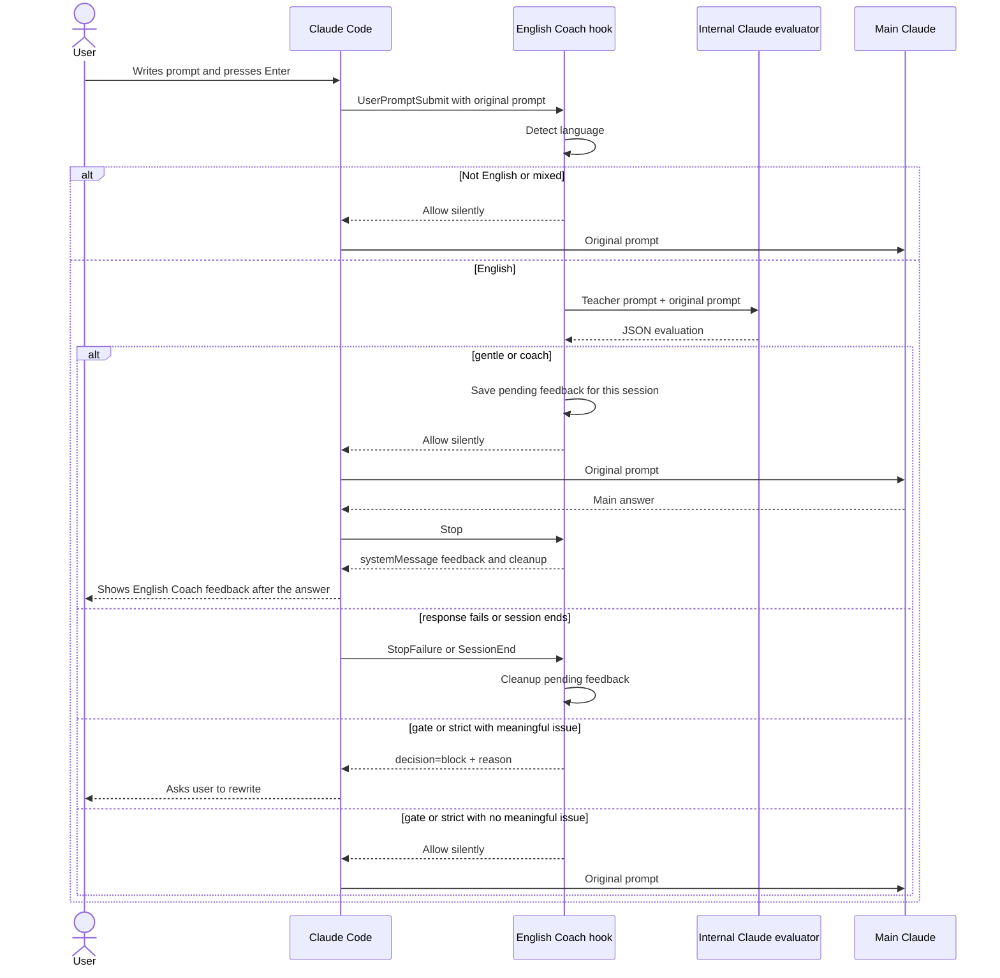

# Prompt English Coach

Prompt English Coach is a Claude Code plugin that turns English prompts into small language lessons without auto-rewriting what you send to Claude.

It is built for deliberate practice, not auto-correction. The plugin checks prompts that are primarily English, gives short teacher-style feedback, and can ask you to rewrite unclear prompts yourself before Claude continues.

Unlike auto-correct plugins, Prompt English Coach does not silently replace your prompt before Claude sees it.

## Quick Start

Install from the marketplace repo:

```text
/plugin marketplace add awkoy/prompt-english-coach
/plugin install prompt-english-coach@prompt-english-coach
```

When Claude Code asks for `mode`, leave the default:

```text
coach
```

Restart Claude Code after install so hooks are loaded. Then check:

```text
/hooks
```

You should see `UserPromptSubmit`, `Stop`, `StopFailure`, and `SessionEnd` hooks from `prompt-english-coach`.

## Features

- Checks English prompts before Claude Code processes them.
- Ignores Russian, non-English, and mixed-language prompts.
- Gives concise, supportive feedback.
- Supports non-blocking and blocking practice modes.
- Uses your existing Claude Code auth through the local `claude` CLI.
- Requires no separate OpenAI or Anthropic API key.

## Fast On/Off

Temporarily disable the coach:

```text
/plugin disable prompt-english-coach@prompt-english-coach
```

Enable it again:

```text
/plugin enable prompt-english-coach@prompt-english-coach
```

You can also do the same from a shell:

```bash
claude plugin disable prompt-english-coach@prompt-english-coach
claude plugin enable prompt-english-coach@prompt-english-coach
```

## Modes

| Mode | Blocks? | Behavior |
| --- | --- | --- |
| `gentle` | No | Shows one short hint after Claude finishes answering. |
| `coach` | No | Shows a corrected version and one to three explanations after Claude finishes answering. |
| `gate` | Yes, for meaningful issues | Asks you to rewrite the prompt yourself. |
| `strict` | Yes, for meaningful issues | Same gate threshold with more complete feedback. |

Gate modes do not block minor style preferences.

## Install

From GitHub:

```text
/plugin marketplace add awkoy/prompt-english-coach
/plugin install prompt-english-coach@prompt-english-coach
```

For local development from a clone:

```text
/plugin marketplace add /absolute/path/to/prompt-english-coach
/plugin install prompt-english-coach@prompt-english-coach
```

On macOS, Claude Code may not be allowed to read plugin marketplaces directly from `~/Documents` unless you grant broader privacy access. If local install fails with `EPERM`, move the clone outside protected folders or install from GitHub instead.

Claude Code will prompt for `mode` when the plugin is enabled. The default is `coach`; leave the field as `coach` unless you want a different behavior. Current Claude Code `userConfig` supports text fields, not enum/select dropdowns.

- `coach` - corrected version and one to three explanations
- `gentle` - one short hint
- `gate` - block meaningful grammar or clarity issues
- `strict` - gate behavior with fuller feedback

If the mode is empty or invalid, the hook falls back to `coach`.

## Update or Reset

Update after a new release:

```text
/plugin marketplace update prompt-english-coach
/plugin update prompt-english-coach@prompt-english-coach
```

Restart Claude Code after updating. Claude Code only updates versioned plugins when the plugin version changes, so each release should bump `plugins/prompt-english-coach/.claude-plugin/plugin.json`.

Clean reinstall:

```text
/plugin uninstall prompt-english-coach@prompt-english-coach
/plugin marketplace remove prompt-english-coach
/plugin marketplace add awkoy/prompt-english-coach
/plugin install prompt-english-coach@prompt-english-coach
```

## Examples

Gentle:

```text
English Coach
Try: "Could you help me fix this component?"
Why: use "help me fix", not "help me to fixing".
```

Gate:

```text
English Coach
Please rewrite this before I continue.

Suggested version:
"Could you check whether this hook works correctly?"

Focus:
- Use "whether" for indirect yes/no questions.
- "Works correctly" sounds more natural than "is working good".
```

## What happens after Enter



No manual system prompt is required. The plugin is activated by installation and hook registration. The internal teacher instructions live inside the hook script and are sent only to the local Claude evaluator.

Non-blocking feedback is delayed until Claude Code fires the `Stop` hook, after the main answer is finished. This keeps the coach note out of the `UserPromptSubmit` output path, where stdout is added to Claude's context. Prompt English Coach still never rewrites the submitted prompt or sends a corrected replacement as the user prompt.

## Plugin

See [plugins/prompt-english-coach/README.md](plugins/prompt-english-coach/README.md).

## Requirements

- Claude Code installed and authenticated.
- Node.js 18 or newer.
- The `claude` CLI available on `PATH`.

## Limitations

- Claude Code controls the visual styling of hook messages. Plugins cannot set a custom color for one `systemMessage`.
- Non-blocking feedback is displayed after the main answer, so it does not affect the prompt that triggered it.
- The delayed feedback is stored briefly in the plugin data directory when available, otherwise in the OS temp directory. Files are user-private, expire after 24 hours, and are cleaned up by `Stop`, `StopFailure`, or `SessionEnd`.
- Very large prompts are truncated to the first 6,000 characters for English evaluation only. The original prompt continues unchanged in non-blocking modes.
- The plugin currently targets Claude Code only.

## Development

```bash
npm run validate
```

To validate with Claude Code:

```bash
claude plugin validate .
claude plugin validate ./plugins/prompt-english-coach
```

Before release, also run an interactive local install check:

```text
/plugin marketplace add /absolute/path/to/prompt-english-coach
/plugin install prompt-english-coach@prompt-english-coach
/hooks
```

Confirm that `/hooks` shows `UserPromptSubmit`, `Stop`, `StopFailure`, and `SessionEnd` hooks and that the selected `mode` appears in the plugin setup flow.

## Publish

1. Authenticate GitHub CLI:

```bash
gh auth login -h github.com
```

2. Create and push the GitHub repository:

```bash
gh repo create awkoy/prompt-english-coach --public --source=. --remote=origin --push
```

Without GitHub CLI:

```bash
git remote add origin git@github.com:awkoy/prompt-english-coach.git
git push -u origin main
```

3. Verify install from GitHub in a fresh Claude Code session:

```text
/plugin marketplace add awkoy/prompt-english-coach
/plugin install prompt-english-coach@prompt-english-coach
/hooks
```

4. For every release:

```bash
npm run validate
claude plugin validate . --strict
claude plugin validate ./plugins/prompt-english-coach --strict
```

Bump the plugin version before publishing changes. Users can then run `/plugin update prompt-english-coach@prompt-english-coach` and restart Claude Code.

## License

MIT
