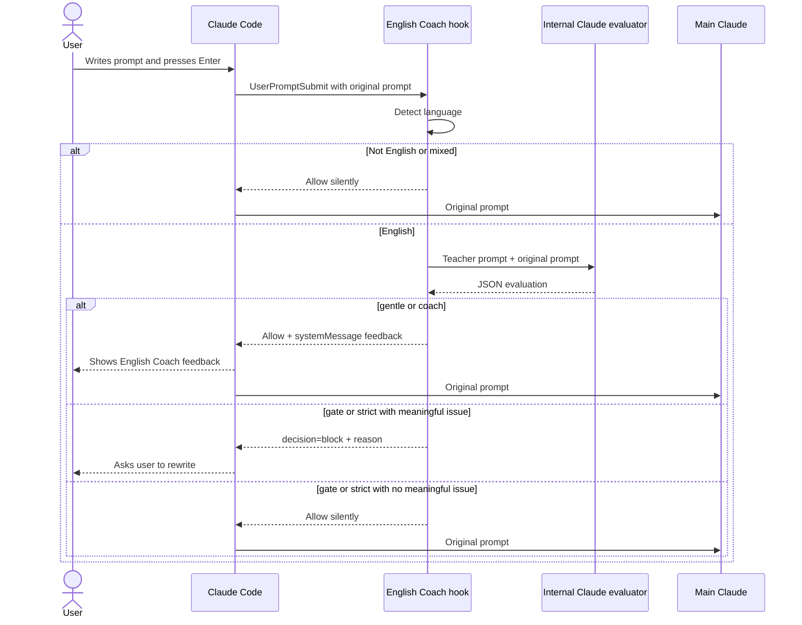

# Prompt English Coach

Prompt English Coach is a Claude Code plugin that turns English prompts into deliberate English practice.

Unlike auto-correct plugins, it does not silently rewrite your prompt before Claude sees it. It teaches you what to improve, and in gate mode it asks you to rewrite the prompt yourself before continuing.

## Install

After publishing this repository to GitHub:

```text
/plugin marketplace add <github-user>/prompt-english-coach
/plugin install prompt-english-coach@prompt-english-coach
```

For local development:

```text
/plugin marketplace add /Users/awkoy/Documents/prompt-english-coach
/plugin install prompt-english-coach@prompt-english-coach
```

## What happens after Enter



No manual system prompt is required. The plugin is activated by installation and hook registration. The internal teacher instructions live inside the hook script and are sent only to the local Claude evaluator.

## Plugin

See [plugins/prompt-english-coach/README.md](plugins/prompt-english-coach/README.md).

## Development

```bash
npm run validate
```

To validate with Claude Code:

```bash
claude plugin validate .
claude plugin validate ./plugins/prompt-english-coach
```

## License

MIT
