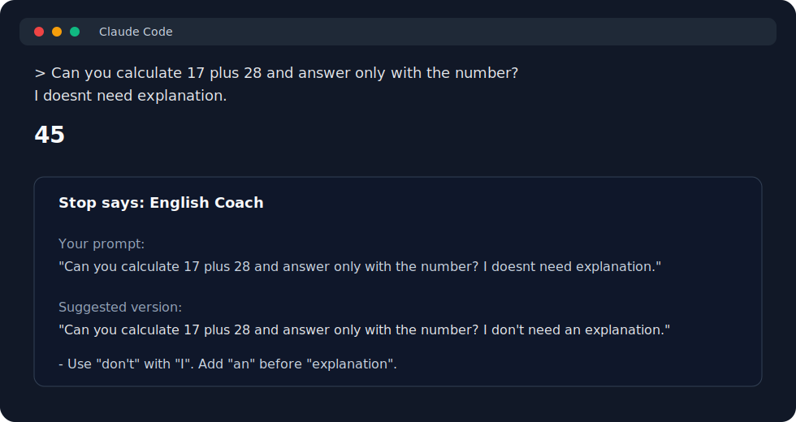
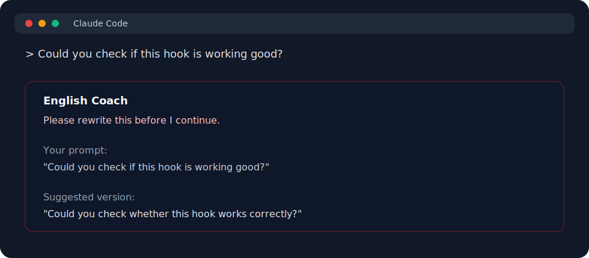
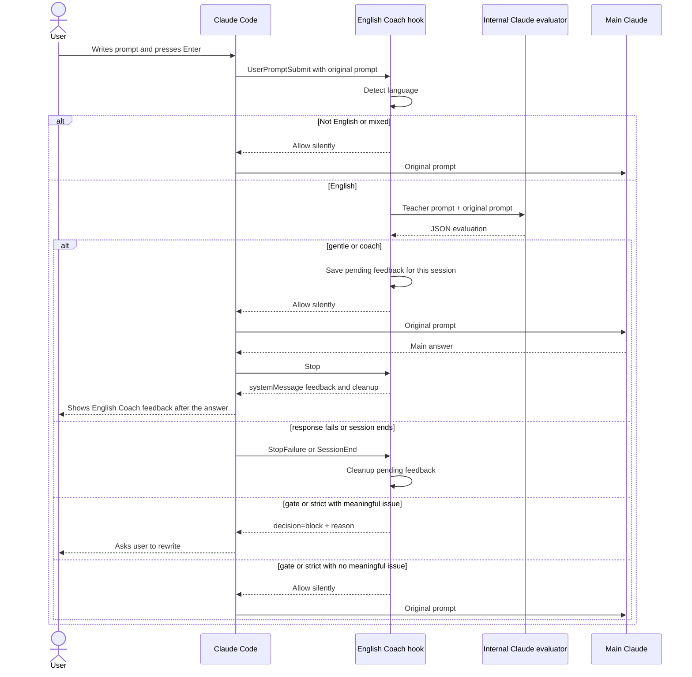

# Prompt English Coach

Turn your Claude Code prompts into English practice.

Prompt English Coach is a Claude Code plugin for developers who write prompts in English and want to get better without leaving the coding flow. It checks English prompts, teaches with short feedback, and can ask you to rewrite unclear prompts yourself.

It does **not** auto-correct or replace your prompt before Claude sees it. Claude gets your original words.

## Quick Start

Install from the marketplace repo:

```text
/plugin marketplace add awkoy/prompt-english-coach
/plugin install prompt-english-coach@prompt-english-coach
```

When Claude Code asks for `mode`, leave the default value:

```text
coach
```

Restart Claude Code after install, then check:

```text
/hooks
```

You should see `UserPromptSubmit`, `Stop`, `StopFailure`, and `SessionEnd` hooks from `prompt-english-coach`.

## Why Use It

- You practice English inside the tool you already use every day.
- You see the original prompt next to the suggested version, so the lesson is obvious.
- You keep control: the plugin never silently rewrites your prompt.
- You can stay low-friction with `coach`, or force deliberate practice with `gate` / `strict`.
- You do not need a separate API key; it uses your existing Claude Code auth through the local `claude` CLI.

## Fast On/Off

Disable the coach:

```text
/plugin disable prompt-english-coach@prompt-english-coach
```

Enable it again:

```text
/plugin enable prompt-english-coach@prompt-english-coach
```

Shell equivalents:

```bash
claude plugin disable prompt-english-coach@prompt-english-coach
claude plugin enable prompt-english-coach@prompt-english-coach
```

## What It Looks Like

In the recommended `coach` mode, Claude answers first. The English note appears after the answer, so it does not get mixed into the prompt Claude is answering.



```text
> Can you calculate 17 plus 28 and answer only with the number? I doesnt need explanation.

45

Stop says: English Coach

Your prompt:
"Can you calculate 17 plus 28 and answer only with the number? I doesnt need explanation."

Suggested version:
"Can you calculate 17 plus 28 and answer only with the number? I don't need an explanation."

Focus:
- Use "don't" with "I".
- Add "an" before "explanation".
```

In `gate` or `strict`, meaningful grammar or clarity issues stop the turn and ask you to rewrite the prompt yourself:



```text
English Coach
Please rewrite this before I continue.

Your prompt:
"Could you check if this hook is working good?"

Suggested version:
"Could you check whether this hook works correctly?"

Focus:
- Use "whether" for indirect yes/no questions.
- "Works correctly" sounds more natural than "is working good".
```

Gate modes do not block small style preferences.

## Modes

| Mode | Blocks? | Best for |
| --- | --- | --- |
| `coach` | No | Daily use. Shows a corrected version and one to three explanations after Claude finishes answering. |
| `gentle` | No | Very low friction. Shows one short hint after Claude finishes answering. |
| `gate` | Yes, for meaningful issues | Deliberate practice. Blocks unclear prompts and asks you to rewrite them. |
| `strict` | Yes, for meaningful issues | Same blocking threshold as `gate`, with fuller feedback. |

If the setup field is empty or invalid, the hook falls back to `coach`.

Current Claude Code `userConfig` supports text fields, not enum/select dropdowns, so the setup UI cannot show a native select yet. The plugin makes the default explicit in the field title and description.

## What Happens After Enter



No manual system prompt is required. The teacher instructions live inside the hook script and are sent only to the local Claude evaluator.

Non-blocking feedback is delayed until Claude Code fires the `Stop` hook, after the main answer is finished. This keeps the coach note out of the `UserPromptSubmit` output path, where stdout can be added to Claude's context.

## Install From a Local Clone

```text
/plugin marketplace add /absolute/path/to/prompt-english-coach
/plugin install prompt-english-coach@prompt-english-coach
```

On macOS, Claude Code may not be allowed to read plugin marketplaces directly from `~/Documents` unless you grant broader privacy access. If local install fails with `EPERM`, move the clone outside protected folders or install from GitHub instead.

## Update or Reset

Update after a new release:

```text
/plugin marketplace update prompt-english-coach
/plugin update prompt-english-coach@prompt-english-coach
```

Restart Claude Code after updating. Claude Code only updates versioned plugins when the plugin version changes.

Clean reinstall:

```text
/plugin uninstall prompt-english-coach@prompt-english-coach
/plugin marketplace remove prompt-english-coach
/plugin marketplace add awkoy/prompt-english-coach
/plugin install prompt-english-coach@prompt-english-coach
```

## Requirements

- Claude Code installed and authenticated.
- Node.js 18 or newer.
- The `claude` CLI available on `PATH`.

## Limitations

- Claude Code controls the visual styling of hook messages. Plugins cannot set a custom color for one `systemMessage`.
- Non-blocking feedback is displayed after the main answer, so it does not affect the prompt that triggered it.
- The delayed feedback is stored briefly in the plugin data directory when available, otherwise in the OS temp directory. Files are user-private, expire after 24 hours, and are cleaned up by `Stop`, `StopFailure`, or `SessionEnd`.
- Very large prompts are truncated to the first 6,000 characters for English evaluation only. The original prompt continues unchanged in non-blocking modes.
- The displayed `Your prompt` block is capped at 240 characters so long prompts do not flood the terminal.
- The plugin currently targets Claude Code only.

## Development

```bash
npm run validate
```

To validate with Claude Code:

```bash
claude plugin validate . --strict
claude plugin validate ./plugins/prompt-english-coach --strict
```

Before release, also run an interactive local install check:

```text
/plugin marketplace add /absolute/path/to/prompt-english-coach
/plugin install prompt-english-coach@prompt-english-coach
/hooks
```

Confirm that `/hooks` shows `UserPromptSubmit`, `Stop`, `StopFailure`, and `SessionEnd` hooks and that the selected `mode` appears in the plugin setup flow.

## Publish

Create or update the public repository, then verify install from a fresh Claude Code session:

```text
/plugin marketplace add awkoy/prompt-english-coach
/plugin install prompt-english-coach@prompt-english-coach
/hooks
```

For every release:

```bash
npm run validate
claude plugin validate . --strict
claude plugin validate ./plugins/prompt-english-coach --strict
```

Bump the plugin version before publishing changes. Users can then run `/plugin update prompt-english-coach@prompt-english-coach` and restart Claude Code.

## License

MIT
