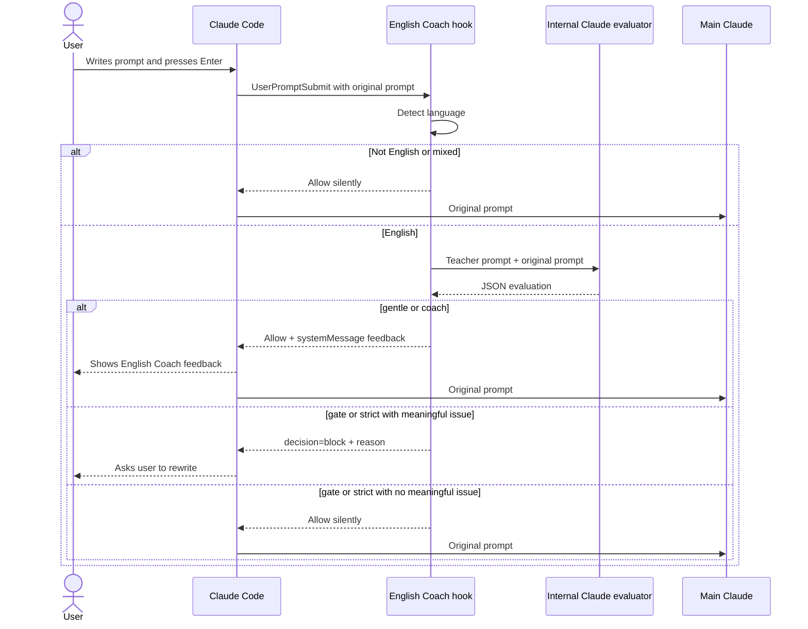

# Prompt English Coach

Prompt English Coach is a Claude Code plugin that turns English prompts into small language lessons.

It is built for deliberate practice, not auto-correction. The plugin checks prompts that are primarily English, gives short teacher-style feedback, and can ask you to rewrite unclear prompts yourself before Claude continues.

Unlike auto-correct plugins, Prompt English Coach does not silently replace your prompt before Claude sees it.

## Features

- Checks English prompts before Claude Code processes them.
- Ignores Russian, non-English, and mixed-language prompts.
- Gives concise, supportive feedback.
- Supports non-blocking and blocking practice modes.
- Uses your existing Claude Code auth through the local `claude` CLI.
- Requires no separate OpenAI or Anthropic API key.

## Modes

| Mode | Blocks? | Behavior |
| --- | --- | --- |
| `gentle` | No | Shows one short hint. |
| `coach` | No | Shows a corrected version and one to three explanations. |
| `gate` | Yes, for meaningful issues | Asks you to rewrite the prompt yourself. |
| `strict` | Yes, for meaningful issues | Same gate threshold with more complete feedback. |

Gate modes do not block minor style preferences.

## Install

After publishing this repository to GitHub:

```text
/plugin marketplace add <github-user>/prompt-english-coach
/plugin install prompt-english-coach@prompt-english-coach
```

For local development:

```text
/plugin marketplace add /Users/awkoy/Documents/prompt-english-coach
/plugin install prompt-english-coach@prompt-english-coach
```

Claude Code will prompt for `mode` when the plugin is enabled. If the mode is empty or invalid, the hook falls back to `coach`.

## Examples

Gentle:

```text
English Coach
Try: "Could you help me fix this component?"
Why: use "help me fix", not "help me to fixing".
```

Gate:

```text
English Coach
Please rewrite this before I continue.

Suggested version:
"Could you check whether this hook works correctly?"

Focus:
- Use "whether" for indirect yes/no questions.
- "Works correctly" sounds more natural than "is working good".
```

## What happens after Enter



No manual system prompt is required. The plugin is activated by installation and hook registration. The internal teacher instructions live inside the hook script and are sent only to the local Claude evaluator.

Claude Code exposes non-blocking hook feedback through `systemMessage`. That message is shown to the user and may be included in the current turn's context by Claude Code. Prompt English Coach still never rewrites the submitted prompt or sends a corrected replacement as the user prompt.

## Plugin

See [plugins/prompt-english-coach/README.md](plugins/prompt-english-coach/README.md).

## Requirements

- Claude Code installed and authenticated.
- Node.js 18 or newer.
- The `claude` CLI available on `PATH`.

## Limitations

- Claude Code controls the visual styling of hook messages. Plugins cannot set a custom color for one `systemMessage`.
- Non-blocking feedback uses Claude Code `systemMessage`; Claude Code may include that message in the current turn's context.
- Very large prompts are truncated to the first 6,000 characters for English evaluation only. The original prompt continues unchanged in non-blocking modes.
- The plugin currently targets Claude Code only.

## Development

```bash
npm run validate
```

To validate with Claude Code:

```bash
claude plugin validate .
claude plugin validate ./plugins/prompt-english-coach
```

Before release, also run an interactive local install check:

```text
/plugin marketplace add /Users/awkoy/Documents/prompt-english-coach
/plugin install prompt-english-coach@prompt-english-coach
/hooks
```

Confirm that `/hooks` shows the `UserPromptSubmit` hook and that the selected `mode` appears in the plugin setup flow.

## License

MIT
