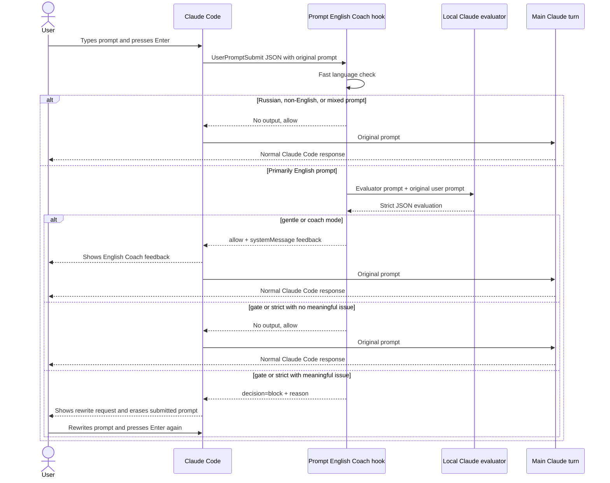

# Prompt English Coach Design

## Architecture Summary

The repository is a Claude Code plugin marketplace. The root `.claude-plugin/marketplace.json` exposes one plugin, `prompt-english-coach`, from `plugins/prompt-english-coach`.

The plugin uses a `UserPromptSubmit` hook. The hook is implemented as a command hook that runs a bundled Node.js script. The script reads Claude Code hook JSON from stdin, decides whether the prompt should be checked, calls Claude CLI for English evaluation, and returns Claude Code hook JSON.

## Why Command Hook Instead of Pure Prompt Hook

Claude Code supports `type: "prompt"` hooks for `UserPromptSubmit`. Prompt hooks are useful for yes/no allow-block checks because the model returns:

```json
{
  "ok": true,
  "reason": "Explanation for the decision"
}
```

That shape is too limited for the full plugin UX. `gentle` and `coach` modes need user-visible non-blocking feedback, and `gate` mode needs stricter output shaping. A command hook can return `systemMessage` for non-blocking teacher feedback or `decision: "block"` for gate behavior.

The command hook still uses Claude internally by invoking the authenticated local Claude CLI in print mode. This keeps the "no separate OpenAI API key" requirement while giving us full hook output control.

## Repository Layout

```text
prompt-english-coach/
  .claude-plugin/
    marketplace.json
  plugins/
    prompt-english-coach/
      .claude-plugin/
        plugin.json
      hooks/
        hooks.json
      scripts/
        coach-core.js
        coach-hook.js
      examples/
        english-clean.json
        english-issue.json
        russian.json
        mixed.json
      README.md
  tests/
    coach-core.test.js
  docs/
    implementation-plan/
      README.md
      01-goal.md
      02-design.md
      03-execution-plan.md
  package.json
  README.md
  LICENSE
```

## Runtime Flow

1. Claude Code fires `UserPromptSubmit`.
2. `hooks/hooks.json` runs `node ${CLAUDE_PLUGIN_ROOT}/scripts/coach-hook.js`.
3. `coach-hook.js` reads hook input from stdin.
4. The script exits silently when:
   - `hook_event_name` is not `UserPromptSubmit`;
   - `PROMPT_ENGLISH_COACH_INTERNAL=1` is set;
   - the prompt is empty;
   - the prompt is not primarily English;
   - the prompt is mixed-language enough that feedback would be noisy.
5. For primarily English prompts, the script calls Claude CLI with an evaluator prompt and the user prompt encoded as a JSON string.
6. The evaluator returns strict JSON describing language, issue severity, corrected version, explanations, and gate recommendation.
7. `coach-core.js` maps that evaluation into Claude Code hook output:
   - `gentle`: allow and show one short hint as `systemMessage`.
   - `coach`: allow and show corrected version plus one to three explanations as `systemMessage`.
   - `gate`: block only meaningful grammar or clarity issues.
   - `strict`: same blocking threshold as gate, with more complete feedback when blocked.
8. If evaluator execution fails, times out, or returns malformed JSON, the hook fails open and allows the user's prompt.

## User Experience Flow



In plain words:

1. The user writes a prompt and presses Enter.
2. Claude Code pauses before the main model call and runs the plugin hook.
3. The hook decides whether this prompt is English enough to coach.
4. If not English, nothing happens.
5. If English, the hook asks a small internal Claude evaluation prompt to inspect the English.
6. In `gentle` or `coach`, the user sees feedback and the original prompt continues.
7. In `gate` or `strict`, meaningful grammar or clarity issues block the prompt; minor style preferences do not.
8. The user rewrites the prompt manually and submits again.

## Prompting Layers

There are two separate prompting layers:

1. Main Claude Code prompt: the user's original coding request. The plugin does not rewrite it and does not require a special Claude Code system prompt.
2. Internal evaluator prompt: a prompt bundled inside `coach-core.js` and sent to the local `claude` CLI by the hook. This is the "English teacher mode" instruction.

The plugin is activated by installation and hook registration, not by asking the user to add system prompts manually.

The evaluator prompt is internal and should say:

```text
You are Prompt English Coach, a concise supportive English teacher for developer prompts.
Analyze only the user prompt in the JSON string below.
Return only valid JSON. Do not use markdown.
Ignore non-English and mixed-language prompts.
Do not shame the user. Be concise and practical.
Classify severity as none, minor, or meaningful.
Meaningful means grammar or clarity problems that can confuse the request.
Minor means style preference or harmless awkward phrasing.
Gate modes must block only meaningful issues.
```

The main Claude turn receives the user's original prompt. In non-blocking modes, the user-visible coaching message is returned as `systemMessage`; it is not an auto-corrected replacement prompt.

Claude Code may include `systemMessage` hook output in the current turn's context. This is an explicit platform tradeoff: non-blocking modes can show feedback without rewriting the prompt, but they cannot guarantee the feedback is user-only. Gate modes keep feedback out of the main Claude turn because `decision: "block"` prevents the prompt from continuing.

## User Configuration

The plugin manifest declares `userConfig.mode`:

```json
{
  "type": "string",
  "title": "Coaching mode: coach, gentle, gate, or strict",
  "description": "Type one value. coach = corrected version + explanations, gentle = one short hint, gate = block meaningful issues, strict = gate with fuller feedback.",
  "default": "coach",
  "required": true
}
```

The hook command receives it through `${user_config.mode}` or `CLAUDE_PLUGIN_OPTION_mode`. The script normalizes invalid values to `coach`.

## Evaluator JSON Contract

The internal Claude evaluator must return only JSON:

```json
{
  "language": "english",
  "isEnglish": true,
  "isMixed": false,
  "hasMeaningfulIssue": true,
  "severity": "meaningful",
  "corrected": "Could you check whether this hook works correctly?",
  "issues": [
    {
      "kind": "grammar",
      "original": "is working good",
      "suggestion": "works correctly",
      "explanation": "\"Works correctly\" is the natural adverb form here."
    }
  ],
  "hint": "Use \"works correctly\", not \"is working good\"."
}
```

Allowed severity values:

- `none`: no feedback needed.
- `minor`: style preference, small wording improvement, or harmless awkwardness.
- `meaningful`: grammar or clarity problem that can confuse the request.

Gate and strict modes block only `meaningful`.

## Feedback Tone

Feedback must be:

- concise;
- supportive;
- practical;
- specific;
- free of shame, sarcasm, or insults.

Accepted header format:

```text
English Coach
Try: "Could you help me fix this component?"
Why: use "help me fix", not "help me to fixing".
```

Gate header format:

```text
English Coach
Please rewrite this before I continue.

Suggested version:
"Could you check whether this hook works correctly?"

Focus:
- Use "whether" for indirect yes/no questions.
- "Works correctly" sounds more natural than "is working good".
```

## Failure Behavior

The hook must fail open. If the evaluator cannot run, the plugin must not block the user. The script may emit no hook output, allowing Claude Code to continue normally.

This is necessary because a language coach should not break a coding session due to a local Claude CLI issue.

## Security and Safety

- The hook reads prompt text and sends it to the local Claude CLI.
- It must not write prompt text to logs by default.
- It must set `PROMPT_ENGLISH_COACH_INTERNAL=1` when invoking Claude CLI to avoid recursive coaching.
- It must not execute shell commands derived from the user prompt.
- It must use `child_process.spawn` with argument arrays, not shell interpolation.

## Documentation Sources

The design relies on these current Claude Code docs:

- Hooks support `UserPromptSubmit` and prompt hooks: https://code.claude.com/docs/en/hooks
- Plugin hooks live in `hooks/hooks.json`: https://code.claude.com/docs/en/plugins-reference
- Marketplaces use `.claude-plugin/marketplace.json`: https://code.claude.com/docs/en/plugin-marketplaces
